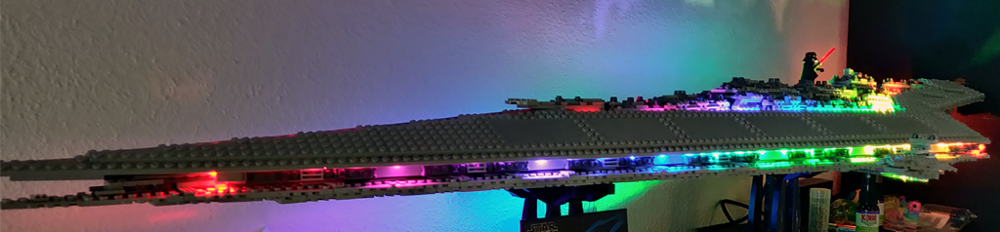

# HASS_NUC

Configuration for [Home Assistant](https://www.home-assistant.io/) running on an [Intel NUC](https://ark.intel.com/content/www/us/en/ark/products/126148/intel-nuc-kit-nuc8i5beh.html) for a three room apartment, offering convenience automations over lights and climate while providing multiple intuitive user controls.

## <a name="hubs">Hubs</a>
| [Go to Menu](#menu) | [Database](#database) | [Ambilight](#ambilight) |

| Device  | Quantity | Connection | HA Component | Notes |
| ------------- | :---: | ------------- | ------------- | ------------- |
| [Hue Hub v2](https://amzn.to/2IpNA3G)| 1 | Ethernet | [Philips Hue](https://www.home-assistant.io/components/hue/) | Controls all Philips Hue smart lights |
| [Conbee II](https://phoscon.de/en/conbee2)| 1 | USB 2.0 | [deCONZ](https://www.home-assistant.io/integrations/deconz/) | Controls zigbee motion sensors and various other sensors |
| [Xiaomi Aqara Gateway v2](https://xiaomi-mi.com/sockets-and-sensors/xiaomi-mi-gateway-2/)| 1 | Wi-Fi | [Xiaomi Aqara](https://www.home-assistant.io/integrations/xiaomi_aqara/) | Deprecated. Everything switched to Conbee II|


Config uses [packages](https://www.home-assistant.io/docs/configuration/splitting_configuration/) to split up the configuration and improve user friendliness. The bulk of automations/configuration can be found [here](https://github.com/DrBlokmeister/HASS_NUC/tree/master/packages).

Config uses [Home Assistant Community Store](https://hacs.xyz/) to implement currently unsupported integrations. The add-ons can be found [here](https://github.com/DrBlokmeister/HASS_NUC/tree/master/custom_components).


## <a name="Ambilight">Ambilight</a>
I use [Hyperion](https://github.com/hyperion-project/hyperion.ng) to provide Ambilight for my TV. Hyperion forwards the data to the three LED strips connected to a Lego Millennium Falcon and a Lego Super Star Destroyer. The configs can be found under [esphome](./esphome).

Atmoorbs:


Falcon:


Super Star Destroyer:


<!-- 


 -->


## <a name="database">Taming the database</a>
I use the [MariaDB](https://github.com/home-assistant/addons/tree/master/mariadb) plugin for Home Assistant. I save the last 7 days of data and I found out that I'm using over 8 GB to store all the data. That was too much for me, especially since the backup directory started growing to humungous sizes. I found [this](https://community.home-assistant.io/t/taming-the-recorder/271932) topic on the Home Assistant forums (thanks to the [author](https://community.home-assistant.io/u/heinrich)) in an attempt to tame the database.

Since I didn't really know how to connect to my database, I wanted to find a nice GUI-capable tool. For this, I have used [dbForge](https://www.devart.com/dbforge/mysql/studio/mariadb-gui-client.html).

Stepwise:
- download and install [dbForge](https://www.devart.com/dbforge/mysql/studio/mariadb-gui-client.html).
- Go to the MariaDB config page, and in the Network section, enter your port number. In my case the Container column reads 3306/tcp and I have entered 3306 below Host.
- Open dbForge and use [this tutorial](https://docs.devart.com/studio-for-mysql/getting-started/connecting-to-db.html) to enter your database details
  - Use type TCP/IP
  - As Host enter your HA IP address and as port enter the port you used (3306 in my case)
  - As User and Password, use the entries in your MariaDB plugin config under logins
  - As Database, use the database name set in your MariaDB plugin config (default is homeassistant)
  - Press Test Connection or Connect if you're feeling lucky!
- Press ctrl+n to start a new SQL
- Query your database using SQL


Some useful commands I have used:
To find out which entities use the most data
```SQL
SELECT entity_id, COUNT(*) as count FROM states GROUP BY entity_id ORDER BY count DESC LIMIT 100;
```
To remove entities from the database directly using [regular expressions](https://mariadb.com/kb/en/like/):
```SQL
-- first test if the regular expression works. I'm looking for e.g.: sensor.blitzwolf_NUC_energy_voltage
SELECT entity_id, COUNT(*) as count FROM states WHERE entity_id LIKE 'sensor.blitzwolf%status' GROUP BY entity_id ORDER BY count DESC LIMIT 10;
-- then remove the entities. This is final!
DELETE FROM states WHERE entity_id LIKE 'sensor.blitzwolf%energy\_voltage';
```
To find out how much data each table (I think it's called a table) uses (credit goes to [mbuscher](https://community.home-assistant.io/t/how-to-reduce-your-database-size-and-extend-the-life-of-your-sd-card/205299/65?u=drblokmeister))
```SQL
SELECT
    table_name AS `Table Name`,
	table_rows AS `Row Count`,
	ROUND(SUM(data_length)/(1024*1024*1024), 3) AS `Table Size [GB]`,
	ROUND(SUM(index_length)/(1024*1024*1024), 3) AS `Index Size [GB]`,
	ROUND(SUM(data_length+index_length)/(1024*1024*1024), 3) `Total Size [GB]`
FROM information_schema.TABLES
WHERE table_schema = 'homeassistant'
GROUP BY table_name
ORDER BY table_name 
```

Another thing I found useful was to plot the first 1000 entities of the first query using Excel and then calculate the sum of all counts up until that entity. That way I found out I could reduce the size of my database by a factor of 10, simply by removing the first 100 entities from the database.

## License
[MIT](https://choosealicense.com/licenses/mit/)
## References
[Geekofweek's README.md](https://github.com/geekofweek/homeassistant/blob/master/README.md) was used as a source of inspiration for this document
