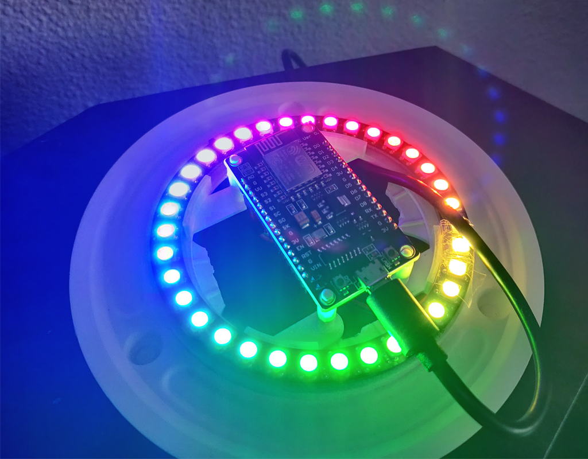
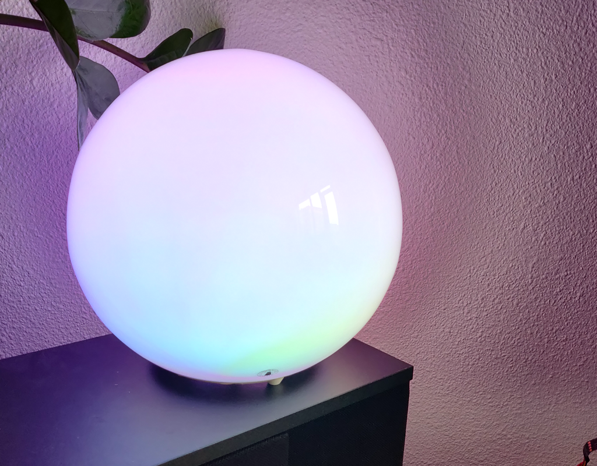
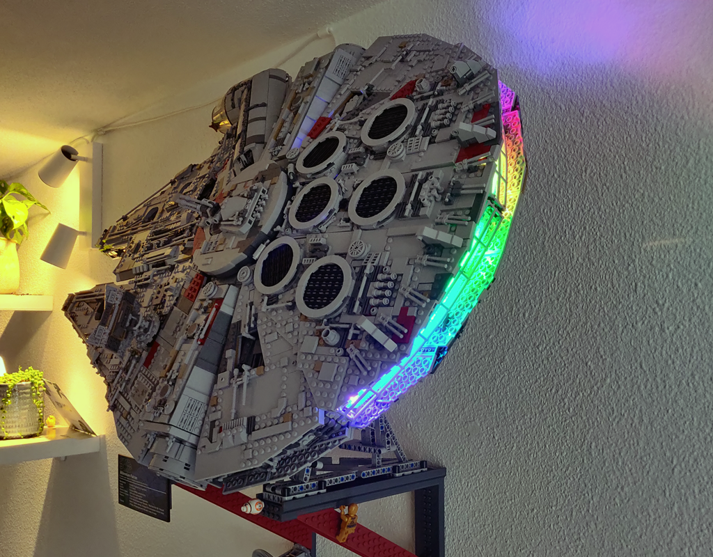
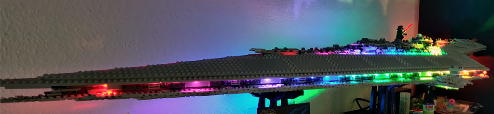
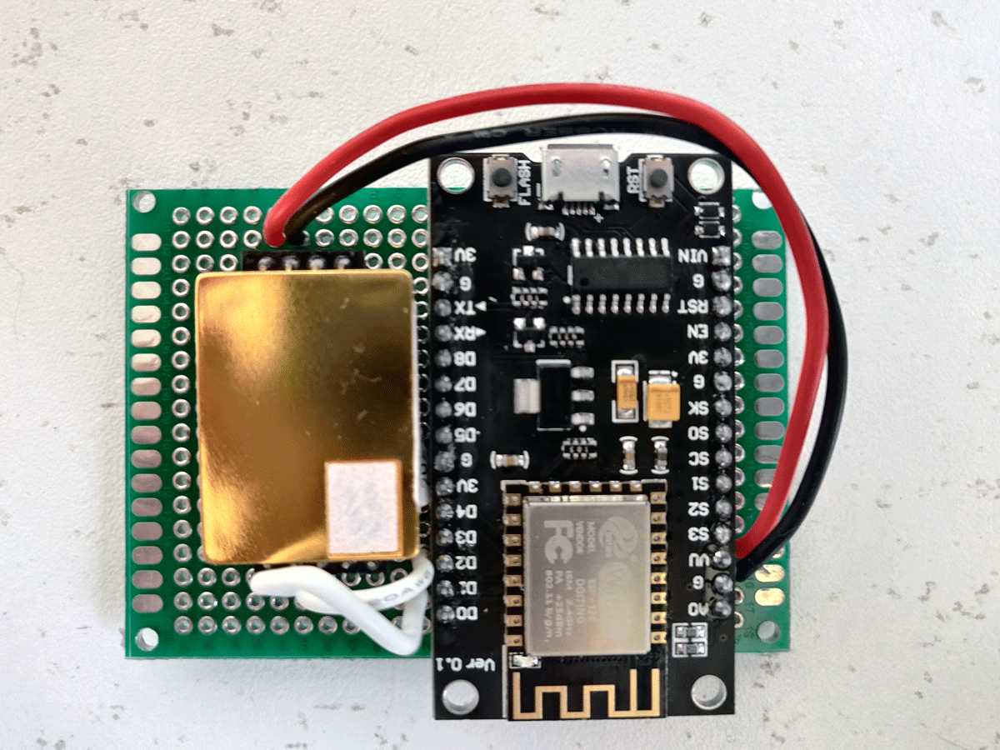
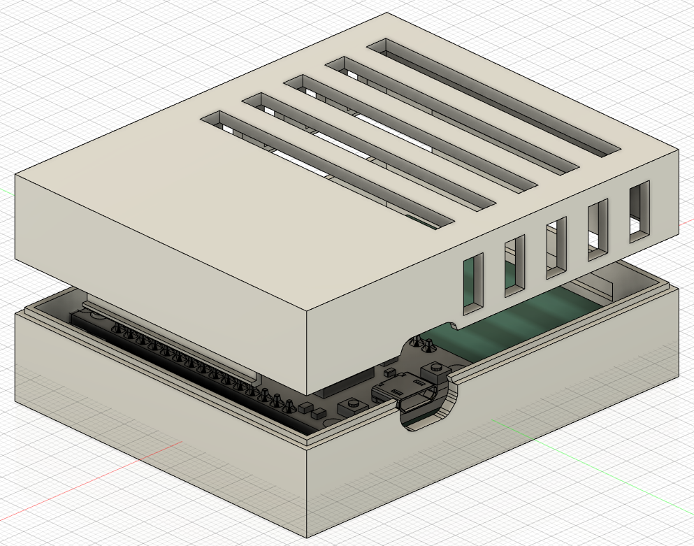
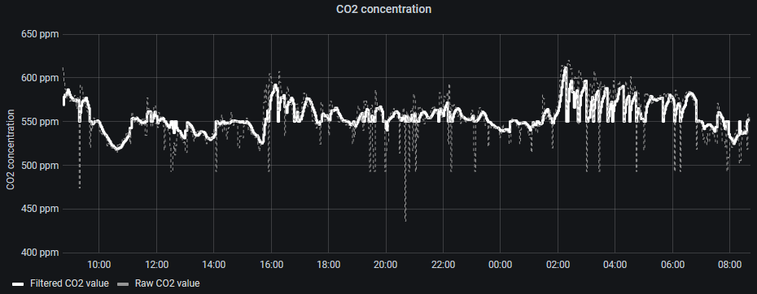
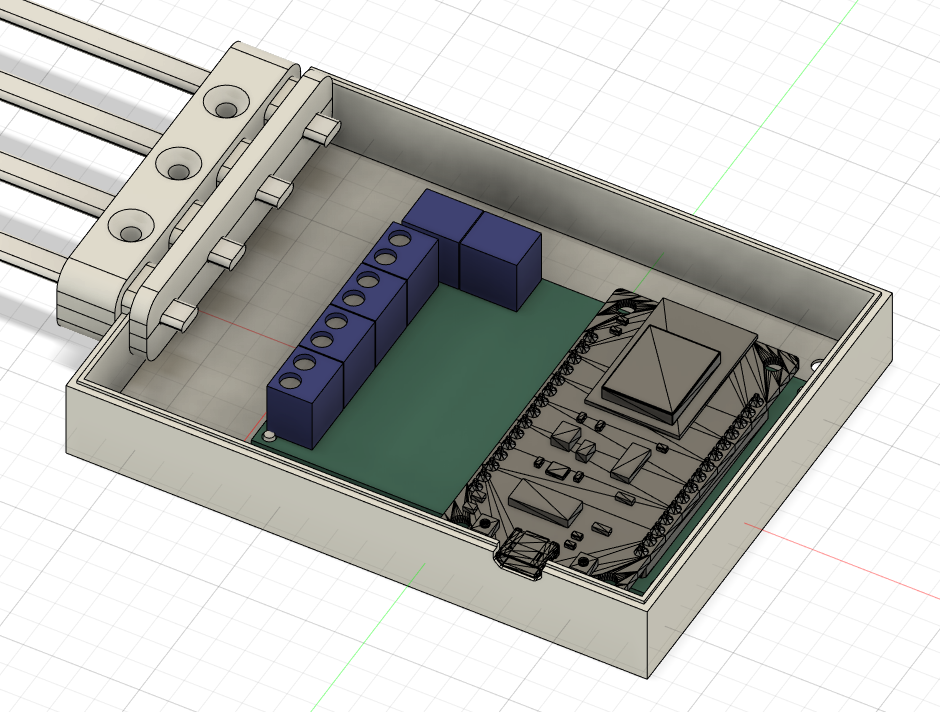
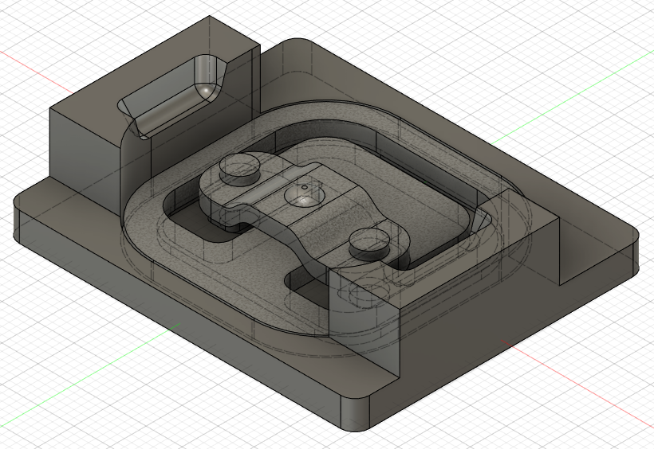
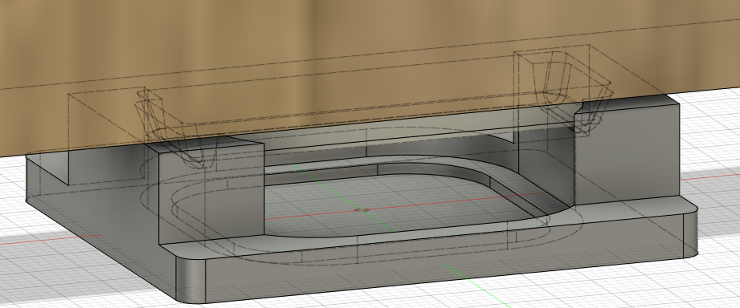

# <a name="ESPHome">ESPHome</a>

For various wireless devices around the house, I use [ESPHome](https://esphome.io/index.html) (see [Home Assistant integration](https://www.home-assistant.io/integrations/esphome/)).

I have used 3 different boards until now. These are:
- [ESP8266 NodeMCU v3](https://nl.aliexpress.com/item/33051171807.html) - The first batch of 8266 NodeMCUs I purchased. The corners are a bit more rounded and the micro USB connection sticks out from the board.
- [Geekcreit ESP8266 NodeMCU CH340G v3](https://www.banggood.com/10Pcs-Geekcreit-Wireless-NodeMcu-Lua-CH340G-V3-Based-ESP8266-WIFI-Internet-of-Things-IOT-Development-Module-p-1734613.html) - The second batch of 8266 NodeMCUs I purchased. The corners are not rounded and the USB connection is sunk a bit deeper into the board (see the [CO2 sensor](#CO2sensor)).
- [ESP32 devkit V1](https://www.banggood.com/ESP32-Development-Board-WiFi+bluetooth-Ultra-Low-Power-Consumption-Dual-Cores-ESP-32-ESP-32S-Board-p-1109512.html) - I purchased two of these boards as a try-out. These support ble tracking.

The current devices I use are as follows:
| Node name | Type | Board | Components | Notes |
| ------------- | :---: | - | ------------- | ---------- |
| [ambilightleft](#atmoorbs) | Light | [ESP8266 NodeMCU batch 1](https://nl.aliexpress.com/item/33051171807.html) | [WS2812 LED ring](https://www.banggood.com/WS2812B-35-Bits-5050-RGB-DIY-LED-Module-Strip-Ring-Light-with-Integrated-Drivers-Board-DC5V-p-1491080.html) |  |
| [ambilightright](#atmoorbs) | Light | [ESP8266 NodeMCU batch 1](https://nl.aliexpress.com/item/33051171807.html) | [WS2812 LED ring](https://www.banggood.com/WS2812B-35-Bits-5050-RGB-DIY-LED-Module-Strip-Ring-Light-with-Integrated-Drivers-Board-DC5V-p-1491080.html) |  |
| [falconlights](#falcon) | Light | [ESP8266 NodeMCU batch 1](https://nl.aliexpress.com/item/33051171807.html) | [APA102 LED strip](https://www.aliexpress.com/item/32969463242.html) |  |
| [stardestroyerlights](#ssdlights) | Light | [ESP8266 NodeMCU batch 1](https://nl.aliexpress.com/item/33051171807.html) | 2x [WS2801 LED strip](https://www.aliexpress.com/item/32311011586.html) |  |
| [bed_scale](#Bedscale) | Sensor | [ESP8266 NodeMCU batch 1](https://nl.aliexpress.com/item/33051171807.html) | [hx711 + 4x load cell](https://nl.aliexpress.com/item/33049336194.html) | Used to measure bed weight to determine bed presence |
| [CO2_sensor](#CO2sensor) | Sensor | [ESP8266 NodeMCU batch 2](https://www.banggood.com/10Pcs-Geekcreit-Wireless-NodeMcu-Lua-CH340G-V3-Based-ESP8266-WIFI-Internet-of-Things-IOT-Development-Module-p-1734613.html) | [MH-Z19b](https://www.banggood.com/MH-Z19B-Upgrade-Version-0-5000PPM-Infrared-CO2-Sensor-For-CO2-Indoor-Air-Quality-Monitor-UART-or-PWM-p-1094463.html) | *Read info below before purchasing this specific sensor!*  Used to measure the CO2 concentration in the bedroom |

# <a name="Ambilight">Ambilight</a>
I use [Hyperion](https://github.com/hyperion-project/hyperion.ng) to provide Ambilight for my TV. Hyperion forwards the data to the three LED strips connected to a Lego Millennium Falcon and a Lego Super Star Destroyer. The configs can be found under [esphome](./esphome).
- [ ] Component list with links for AtmoOrbs
- [ ] Component list with links for Falconlights
- [ ] Component list with links for SSDlights
- [ ] Document Hyperion configuration
- [ ] Document used protocol
- [ ] Link to scripts in ./areas/mediacenter.yaml

## <a name="atmoorbs">AtmoOrbs</a>:

The AtmoOrbs are made up by a NodeMCU board connected to a [LED ring with 35 integrated WS2812 LEDs](https://www.banggood.com/WS2812B-35-Bits-5050-RGB-DIY-LED-Module-Strip-Ring-Light-with-Integrated-Drivers-Board-DC5V-p-1491080.html) built inside an [Ikea Fado lamp](https://www.ikea.com/nl/en/p/fado-table-lamp-white-80096372/). The lamp requires a bit of modification to fit the LED ring, and I have designed a [holder](https://www.thingiverse.com/thing:4777153) to fix the ring and NodeMCU to the lamp base. The color data is sent from Hyperion to the NodeMCU via the UDP E1.31 protocol, and there is no noticable delay.

## <a name="falcon">Falconlights</a>:

## <a name="ssdlights">Star Destroyer Lights</a>:

<!-- 

 -->

# <a name="Sensors">Sensors</a>
A collection of various DIY sensors.

## <a name="CO2sensor">CO2 Sensor</a>

Bad indoor air quality, including CO2 concentration, [has a negative effect on human health](https://en.wikipedia.org/wiki/Carbon_dioxide#Below_1%). To monitor indoor air quality, I built this simple CO2 detector. I use the [MH-Z19b](https://www.banggood.com/MH-Z19B-Upgrade-Version-0-5000PPM-Infrared-CO2-Sensor-For-CO2-Indoor-Air-Quality-Monitor-UART-or-PWM-p-1094463.html) as a basis for this sensor. The sensor measures CO2 concentration by measuring optical absorption of the air. Since [CO2 absorbs certain frequencies of radiation](https://en.wikipedia.org/wiki/Greenhouse_effect#Greenhouse_gases), the absorption of light gives information on the current CO2 concentration in the air.

ESPHome has a built-in functionality to read out the MH_Z19 sensor through [this component](https://esphome.io/components/sensor/mhz19.html).

The ESPHome configuration file can be found under [CO2_sensor.yaml](CO2_sensor.yaml)

### Important information:
The sensor I received from Banggood is a so-called 'fake' sensor. It is much less stable than the original variant. This also explains the noisy sensor read-outs that I'm suffering from. More information can be found [**here**](https://revspace.nl/MH-Z19B#Fake_MH-Z19B_.28black_PCB.29). **Please ensure that the item is a 'good' sensor before hitting the purchase button**.

Board layout:

The 3d-printable enclosure I created [can be found on thingiverse](https://www.thingiverse.com/thing:4779095).

The data coming from the sensor are quite noisy and contain lots of 0-values. To counteract this, I have created a template sensor in ESPHome that ignores these values and uses a filter to take a 12-point average. This doesn't fully resolve the issues I have, but results in data that is more trustworthy, as you can see below. Regardless, I advise to not take this particular sensor, but to find a non-fake sensor.

## <a name="Bedscale">Bed scale</a>

[Thingiverse link](https://www.thingiverse.com/thing:4640214)

[Thingiverse link](https://www.thingiverse.com/thing:4614359)
